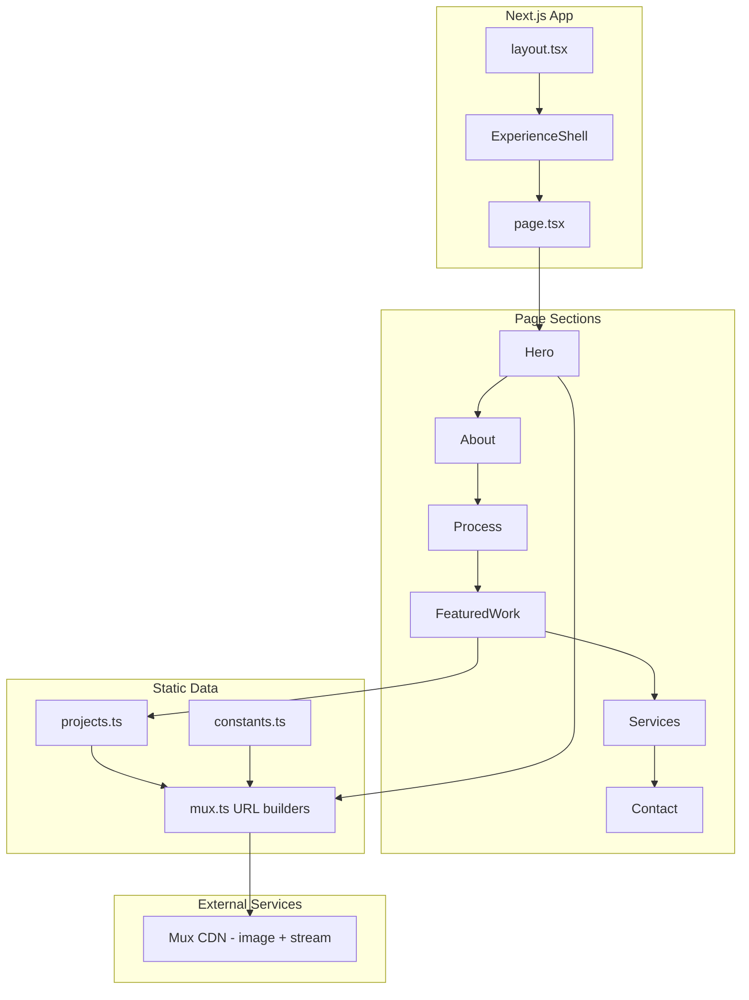

# Architecture

This document describes the system design, data flow, and technology choices behind the Goose Productions portfolio.

**Last verified against:** Next.js 16.2.9

## Overview

The portfolio is a single-page experience built with Next.js App Router plus supporting static routes (`/privacy`, metadata routes). It has no custom backend or database. Content is static TypeScript data, and video is delivered through Mux's public CDN using playback IDs.



## Technology Stack

| Layer | Technology | Purpose |
|-------|------------|---------|
| Framework | Next.js 16 (App Router) | Routing, SSR, font optimization, image config |
| Language | TypeScript (strict) | Type safety across the codebase |
| UI | React 19 | Component model with React Compiler enabled |
| Styling | Tailwind CSS v4 | Utility-first CSS with design tokens in `globals.css` |
| Animation | GSAP + `@gsap/react` | ScrollTrigger scrub, loader timeline, process section |
| Motion | Motion (`motion/react`) | Section entrance animations, modal transitions |
| Scroll | Lenis | Smooth scroll with GSAP ticker bridge |
| Video | Mux (`@mux/mux-player-react`) | HLS streaming, animated WebP previews, poster frames |
| Icons | Lucide React | UI icons (close, arrow, etc.) |
| Testing | Vitest + Testing Library + Playwright | Unit, component, and e2e tests |

## Rendering Model

### Server Components (default)

- `layout.tsx` — HTML shell, fonts, metadata, skip link
- `page.tsx` — Composes all six sections (Hero static; below-fold sections dynamically imported)
- `not-found.tsx` — Branded 404 page

### Client Components (`"use client"`)

All section components are client components because they use Motion, GSAP, or breakpoint hooks:

- `Hero`, `About`, `Process`, `FeaturedWork`, `Services`, `Contact`

```
layout.tsx
  └── ExperienceShell (client)
        ├── SmoothScroll (Lenis + GSAP ticker)
        ├── CursorProvider (state store)
        ├── CustomCursor (ring + dot + label)
        ├── CinematicLoader (session one-shot overlay)
        ├── film-grain (CSS overlay)
        └── TransitionManager (route change animations)
              └── page.tsx (children)
                    ├── Hero (client — video, audio toggle)
                    ├── Process (client — GSAP ScrollTrigger)
                    └── FeaturedWork (client — modal, project cards)
```

`ExperienceShell` is the single client boundary that wraps all experience systems. Everything below it stays server-rendered by default unless a child component opts into `"use client"`.

## Data Flow

### Content

All portfolio content is defined as typed TypeScript constants:

1. **Projects** — `src/data/projects.ts` defines the `Project` interface and `projects` array
2. **Brand** — `src/lib/constants.ts` defines `BRAND`, `CONTACT`, timing, and session keys
3. **Mux URLs** — `src/lib/mux.ts` builds poster, preview, and stream URLs from playback IDs

There is no CMS, API, or database. To update content, edit the TypeScript files and redeploy.

### Video Pipeline

```
Mux Dashboard (upload master)
  → Playback ID (public alphanumeric string)
    → projects.ts (playbackId field)
      → mux.ts (URL builders)
        → Mux CDN (image.mux.com, stream.mux.com)
          → Browser (poster img, animated WebP, HLS player)
```

- **Poster frames** — `image.mux.com/{id}/thumbnail.webp?time=N&width=W`
- **Hover previews** — `image.mux.com/{id}/animated.webp?start=N&end=N&width=W`
- **Full playback** — `stream.mux.com/{id}.m3u8` via Mux Player in the modal

Placeholder playback IDs (e.g. `[PLAYBACK_ID_01]`) are detected by `isRealPlaybackId()` and show "Coming Soon" without making Mux requests.

## Routing

The app has two primary routes:

| Route | File | Description |
|-------|------|-------------|
| `/` | `src/app/page.tsx` | Home page with all sections |
| `/privacy` | `src/app/privacy/page.tsx` | Data collection and analytics disclosure |

No API routes, dynamic routes, or middleware exist.

## Key Design Decisions

1. **No backend** — Static site with Mux CDN for video. No server-side data fetching.
2. **Minimal environment surface** — Public runtime config is limited to contact endpoint and analytics toggle.
3. **Single client boundary** — `ExperienceShell` mounts all interactive systems in one place, keeping the rest server-rendered.
4. **Session-based loader** — The cinematic intro plays once per browser tab via `sessionStorage`.
5. **Progressive video loading** — Hover previews load only when cards enter the viewport (IntersectionObserver) and only on fine-pointer devices without reduced motion.

## Related Documentation

- [Project Structure](project-structure.md) — File-by-file directory map
- [Experience](experience.md) — Loader, cursor, scroll, and transition details
- [Content Management](content-management.md) — How to edit projects and brand
- [Video Ingest](video-ingest.md) — Mux upload and playback ID workflow
