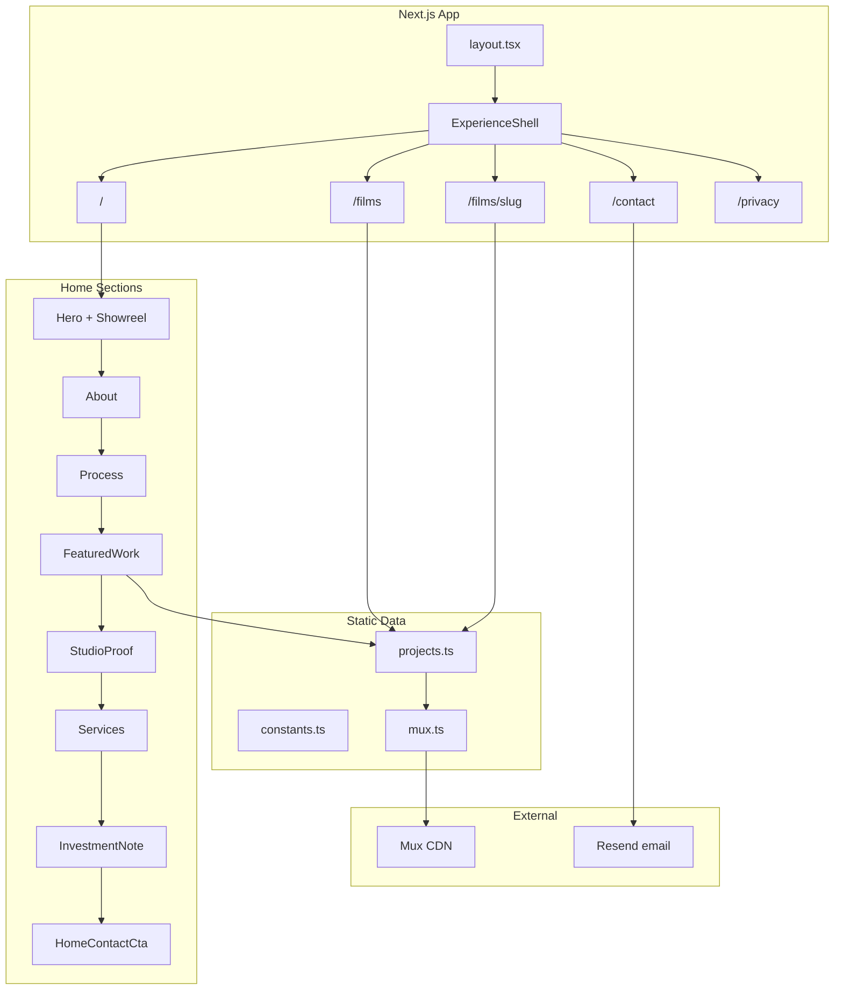

# Architecture

This document describes the system design, data flow, and technology choices behind the Goose Productions portfolio.

**Last verified against:** Next.js 16.2.9 (Part 4)

## Overview

Goose Productions is a multi-route Next.js App Router portfolio: cinematic home and films surfaces, dedicated film pages, light contact/privacy routes, and a serverless contact API. There is no CMS or database. Content is static TypeScript; video is delivered through Mux using public playback IDs.



## Routes

| Route | File | Experience mode | Description |
|-------|------|-----------------|-------------|
| `/` | `src/app/page.tsx` | cinematic | Home — wedding-cinema story |
| `/films` | `src/app/films/page.tsx` | cinematic | Studio archive index + filters + modal |
| `/films/[slug]` | `src/app/films/[slug]/page.tsx` | cinematic | Dedicated film page (SSG) |
| `/contact` | `src/app/contact/page.tsx` | light | Inquiry form + expectations |
| `/privacy` | `src/app/privacy/page.tsx` | light | Privacy disclosure |
| `/api/contact` | `src/app/api/contact/route.ts` | — | Contact POST → Resend |

Legacy `?project={id}` query params on `/` and `/films` redirect to `/films/{id}` (compat only — not a modal deep link).

## Experience modes

`getExperienceMode(pathname)` in `src/lib/experience-mode.ts`:

| Mode | Routes | Mounts |
|------|--------|--------|
| **cinematic** | `/`, `/films`, `/films/*` | Lenis (capability-gated), CustomCursor, CinematicLoader, film-grain |
| **light** | `/contact`, `/privacy`, other | `PathScrollReset` only — no Lenis, cursor UI, loader, or grain |

`SiteNav` / `DesktopNav` / `CursorProvider` stay mounted across mode switches so mobile menus are not torn down mid-navigation. HTML exposes `data-experience-mode`.

## Technology Stack

| Layer | Technology | Purpose |
|-------|------------|---------|
| Framework | Next.js 16 (App Router) | Routing, SSR/SSG, metadata, OG images |
| Language | TypeScript (strict) | Type safety |
| UI | React 19 | React Compiler enabled |
| Styling | Tailwind CSS v4 | Design tokens in `globals.css` |
| Animation | GSAP + Motion | Process pin, loader, section motion |
| Scroll | Lenis | Desktop cinematic smooth scroll |
| Video | Mux | HLS, posters, animated previews |
| Email | Resend | Contact notifications |
| Testing | Vitest + Playwright | Unit, component, e2e (+ visual snapshots) |

## Rendering Model

### Server

- `layout.tsx` — fonts, metadata, skip link, `ExperienceShell`
- Home / films / film pages compose content; film pages use `generateStaticParams`
- Colocated `opengraph-image.tsx` for `/`, `/films`, and `/films/[slug]`

### Client boundary

```
ExperienceShell
  ├── SmoothScroll | PathScrollReset   (mode-gated, effect-only)
  ├── CursorProvider
  │     ├── SiteNav / DesktopNav
  │     ├── CustomCursor               (cinematic only)
  │     ├── CinematicLoader            (cinematic only)
  │     ├── film-grain                 (cinematic only)
  │     └── TransitionManager          (enter-veil; no page AnimatePresence)
  │           └── route children
```

## Scroll Lifecycle

Cinematic: `SmoothScroll` + `scroll-layout.ts` (Lenis ↔ ScrollTrigger). Light: `PathScrollReset` (native scroll + route reset). Route changes call `resetScrollPosition()` and `clearScrollLockArtifacts()`.

**Contract:** Layout height changes (dynamic imports, GSAP pin spacers) must call `refreshScrollLayout()`. Never wrap pinned Process trees in `AnimatePresence` exit animations.

## Data Flow

1. **Projects** — `src/data/projects.ts`
2. **Brand / showreel** — `src/lib/constants.ts`
3. **Mux URLs** — `src/lib/mux.ts`
4. **Film helpers** — `src/lib/projects.ts` (`filmPath`, `getFilmStaticParams`, …)

Video pipeline: Drive → ingest CLI → Mux → `playbackId` in `projects.ts` → Mux CDN.

## Contact form delivery

POST `/api/contact` → validate → optional Upstash rate limit → Resend email to `CONTACT.email`.

## Key Design Decisions

1. No database / CMS — TypeScript content + Mux CDN
2. Tiered ExperienceShell — cinematic cost only where it matters
3. Enter-veil transitions — GSAP pin–safe
4. Session loader — once per tab on cinematic entry
5. Captions only with real transcripts (no stub VTT)
6. Decide-don’t-build register — see [roadmap-decisions.md](roadmap-decisions.md)

## Related Documentation

- [Project Structure](project-structure.md)
- [Experience](experience.md)
- [Content Management](content-management.md)
- [Deployment](deployment.md)
- [Roadmap Decisions](roadmap-decisions.md)
