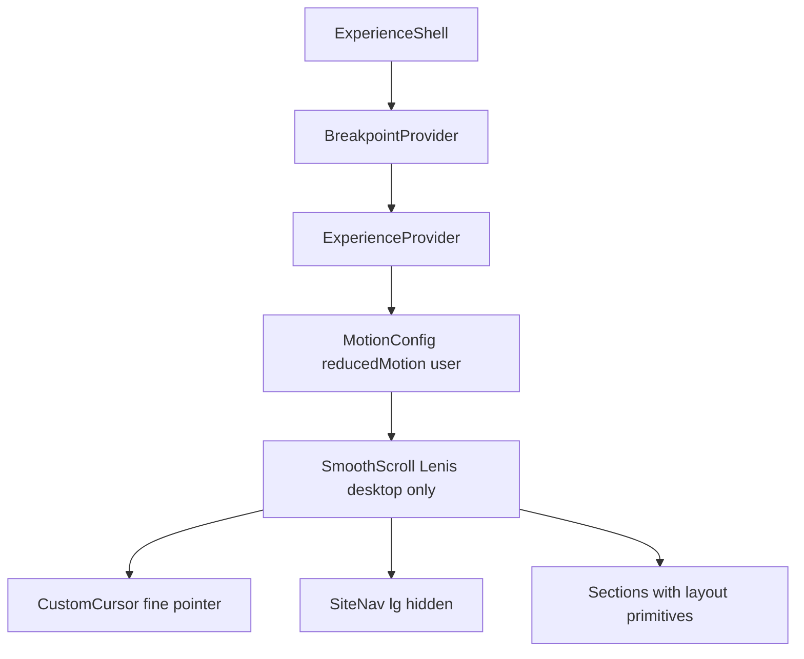

# Responsive Experience Review

Senior frontend review of the responsive redesign implementation.

**Date:** 2026  
**Stack:** Next.js 16, React 19, Tailwind CSS v4, GSAP, Motion, Lenis, Mux

## 1. Current responsive architecture



**Single source of truth:** `breakpoints.ts` + `BreakpointProvider` replace scattered `useMediaQuery` calls with inconsistent thresholds (640px, 767px, 1024px).

**Layout layer:** `Container`, `Section`, `SectionHeader`, `Stack`, `MediaFrame` standardize spacing via CSS custom properties.

**Experience tiering:** Scroll, cursor, and animation complexity gated by `deviceTier` + `finePointer` + `prefers-reduced-motion`.

## 2. Improvements made

| Area | Before | After |
|------|--------|-------|
| Breakpoints | 3 conflicting JS thresholds + unused `BREAKPOINTS` constant | Unified tier system with shared provider |
| Hero footer | Horizontal squeeze on 320px | Stacked layout on mobile |
| Contact CTA | `inline-flex` overflow risk | Fluid `text-cta` with wrap |
| Lenis | Always on (including touch) | Desktop + fine pointer only |
| Reduced motion | Partial (7 files) | `MotionConfig` + tier-aware presets |
| Hero video | Mobile only at 640px | Mobile + tablet poster; desktop video |
| Mux images | Fixed 1920px everywhere | Tier-based widths + `sizes` attribute |
| Modal player | 2160p everywhere | 1080p on mobile/tablet |
| Navigation | Scroll only | Fullscreen mobile nav below 1024px |
| Film grain | Animated on all devices | Static on mobile |
| Bundle | All sections eager | Below-fold sections dynamically imported |
| Process scrub | 1024px only | 1024px + fine pointer |

## 3. Remaining risks

| Risk | Severity | Notes |
|------|----------|-------|
| Color contrast on `--color-dim` text | Medium | axe flags serious violations; design choice for cinematic dim aesthetic |
| Hydration tier flash | Low | SSR defaults to mobile tier; brief layout shift possible on desktop. **Accepted:** HeroBackdrop renders CSS poster until hydrated video mounts. |
| iPad with trackpad | Low | May get desktop tier behaviors at 1024px+ — intended |
| SiteNav + modal scroll lock | Low | Both set `body.overflow`; modal uses ExperienceProvider lock for Lenis |
| Dynamic section loading | Low | Brief placeholder flash on slow connections |

## 4. Performance considerations

- **Lenis + GSAP ticker** no longer runs on mobile/tablet — significant scroll performance win
- **Tier-based Mux widths** reduce mobile bandwidth (~640px vs 1920px posters)
- **Hero `preload="metadata"`** instead of `auto` on desktop
- **Dynamic imports** for About, Process, FeaturedWork, Services, Contact reduce initial JS
- **CustomCursor RAF** pauses when tab hidden or modal open
- **Animated WebP** gated to desktop + fine pointer only

## 5. Future recommendations

1. **Contrast pass** — Tune `--color-dim` to `#6b6b6b` for WCAG AA on small eyebrow text if accessibility certification is needed
2. **`next/image` for static posters** — Adopt selectively for non-animated Mux thumbnails with responsive `sizes`
3. **Container queries** — Consider `@container` for component-level typography on ultra-wide displays
4. **Visibility resume handler** — Add `pageshow` / `visibilitychange` handler for hero video on iOS tab return
5. **Playwright visual smoke** — Optional viewport screenshot suite if design regression monitoring is needed later
6. **Shared `useBreakpoint` in tests** — E2E coverage for 390px, 768px, 1440px viewports

## Test coverage

| Layer | Coverage |
|-------|----------|
| Unit | `breakpoints.ts` tier mapping and width helpers |
| Component | Existing suite updated with `BreakpointProvider` |
| E2E | `responsive.spec.ts` — 320px overflow, nav visibility, CTA fit |

Run full verification:

```bash
cd frontend
npm run check
npm run test:e2e
```
